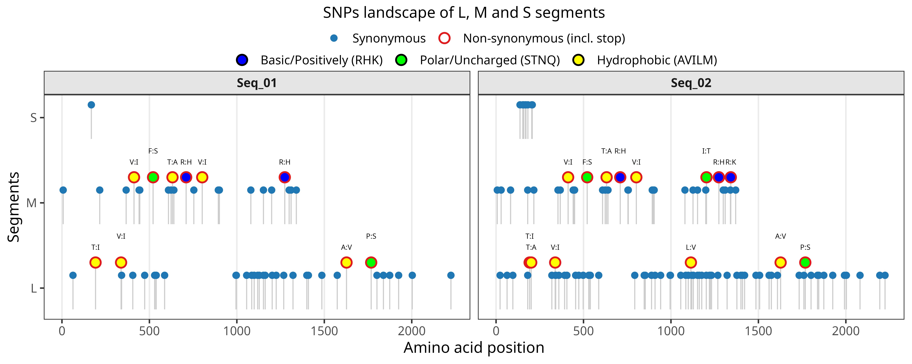

# SNPs Landscape de Oropouche (L / M / S)

[](https://www.r-project.org/)
[](#licença)

Um pipeline em **R** para catalogar SNPs (com impacto em regiões codificantes) e gerar uma figura **mutational landscape** pronta para publicação para os segmentos de Oropouche **L, M e S** — agora fornecido como **um único script** com **flags de execução** (Parte 1 / Parte 2) e **cache automático** (pula a Parte 1 se os outputs já existirem).

---

## Sumário
- [Estrutura do repositório](#estrutura-do-repositório)
- [Entradas](#entradas)
- [Saídas](#saídas)
- [Como rodar](#como-rodar)
  - [Flags: rodar Parte 1 / Parte 2](#flags-rodar-parte-1--parte-2)
  - [Pulo automático (cache) da Parte 1](#pulo-automático-cache-da-parte-1)
- [Visão geral do pipeline](#visão-geral-do-pipeline)
- [Customizações visuais do plot](#customizações-visuais-do-plot)
  - [Cores](#cores)
  - [Exportação (PNG/SVG/PDF)](#exportação-pngsvgpdf)
- [Solução de problemas](#solução-de-problemas)
- [Licença](#licença)
- [Como citar](#como-citar)

---

## Estrutura do repositório

Estrutura recomendada:

```
.
├── scripts/
│   ├── Mapping-and-plot_SNPs_landscape.R         
│   └── Mapping-and-plot_SNPs_landscape_pt-br.R  
├── examples/                    
│   ├── input/L_aln.fasta
│   ├── input/M_aln.fasta
│   └── input/S_aln.fasta
└── outputs/                         
    ├── L_snps_catalogue.csv
    ├── M_snps_catalogue.csv
    ├── S_snps_catalogue.csv
    ├── LMS_snps_catalogue.csv
    ├── LMS_snps_catalogue_summary.csv
    └── figures/
        ├── mutational_landscape_L_M_S.png
        ├── mutational_landscape_L_M_S.svg
        └── mutational_landscape_L_M_S.pdf
```

---

## Entradas

### Requeridas
- FASTA de nucleotídeos **alinhado (MSA)**, um por segmento (L/M/S).
  - Deve conter **uma referência** e **N amostras** (ex.: `Seq_01`, `Seq_02`, …).
  - Todas as sequências devem ter o **mesmo comprimento** (alinhamento válido).
- Esses FASTAs são lidos a partir de **`PARAM$input_dir`** (Parte 1).

---

## Saídas

### Catálogo (Parte 1)
- `L_snps_catalogue.csv`, `M_snps_catalogue.csv`, `S_snps_catalogue.csv`
- `LMS_snps_catalogue.csv` (L+M+S mesclados)
- `LMS_snps_catalogue_summary.csv` (sumário por amostra/segmento/efeito)

### Figura (Parte 2)
- `mutational_landscape_L_M_S.png`
- `mutational_landscape_L_M_S.svg`
- `mutational_landscape_L_M_S.pdf`

---

## Como rodar

Este pipeline foi pensado para **execução interativa no RStudio**.

### Passo 0) Abra o script
No painel **Files** do RStudio, abra:

- `scripts/Mapping-and-plot_SNPs_landscape_pt-br.R` (PT-BR) **ou**
- `scripts/Mapping-and-plot_SNPs_landscape.R` (EN)

### Etapa 1) Editar parâmetros (BLOCO 1)
No script, localize e edite os blocos de parâmetros:

- `PARAM` (Parte 1: entradas FASTA, identificadores da referência e pasta de saída)
  - Entradas FASTA e saídas (exemplos de caminhos):
    - Linux/macOS: `/home/user/Oropouche_SNPs_Landscape/examples/input`
    - Windows: `C:/Users/Name/.../examples/input`
  - Cabeçalhos da referência (`ref_id`):
    - Abra o FASTA alinhado e copie exatamente a linha do cabeçalho da sequência de referência (linha completa iniciada por `>`).
    - Alternativamente, liste os primeiros cabeçalhos via shell:
      - `head -n 5 file.fasta`

- `PARAM_PLOT` (Parte 2: entradas/saídas do gráfico e opções de exportação das figuras)

### Passo 2) Rode no RStudio
Escolha uma opção:
- Selecione **o script inteiro** e clique em **Run** (ou `Ctrl+A` → `Ctrl+Enter`);
- Rode **bloco a bloco** (recomendado): selecione cada bloco e pressione `Ctrl+Enter`.

---

### Nota sobre a entrada da Parte 2
Por padrão, a Parte 2 lê `LMS_snps_catalogue.csv` a partir de **`PARAM$output_dir`** (porque ele é gerado pela Parte 1).  
Se você quiser plotar um catálogo gerado em outro local, ajuste `PARAM_PLOT$workdir` e/ou `PARAM_PLOT$arquivo_entrada` (ou `datafr_file`, dependendo do script) conforme necessário.

## Flags: rodar Parte 1 / Parte 2

No topo do script (BLOCO 0), configure:

```r
RUN_PART1   <- TRUE   # gera o catálogo de SNPs (CSVs)
RUN_PART2   <- TRUE   # gera o plot (mutational landscape)
FORCE_PART1 <- FALSE  # recalcula a Parte 1 mesmo se LMS_snps_catalogue.csv já existir
```

Casos comuns:

- **Rodar tudo (Parte 1 + Parte 2)**  
  `RUN_PART1 <- TRUE` e `RUN_PART2 <- TRUE`

- **Rodar somente Parte 1 (gerar/atualizar CSVs)**  
  `RUN_PART1 <- TRUE` e `RUN_PART2 <- FALSE`

- **Rodar somente Parte 2 (plot), sem recalcular**  
  `RUN_PART1 <- FALSE` e `RUN_PART2 <- TRUE`  
  (requer que `LMS_snps_catalogue.csv` exista)

---

## Pulo automático (cache) da Parte 1

A Parte 1 verifica se o catálogo mesclado já existe em **`PARAM$output_dir`**:

- `file.path(PARAM$output_dir, PARAM$merged_out_csv)`  
  (padrão: `.../LMS_snps_catalogue.csv`)

Se ele existir e `FORCE_PART1 <- FALSE`, a **Parte 1 é pulada automaticamente** e o pipeline segue para a Parte 2 (se habilitada).

Para forçar o recálculo (ex.: após mudar FASTAs/ref_id/filtros), defina:

- `FORCE_PART1 <- TRUE`

---

## Visão geral do pipeline

1. Carrega os FASTAs alinhados e identifica a sequência de referência.
2. Varre colunas do alinhamento e chama SNPs vs a referência (ignorando indels/gaps se configurado).
3. Converte coordenadas do alinhamento → coordenadas da referência (referência sem gaps).
4. Traduz e classifica o efeito das mutações:
   - `synonymous` → **Syn**
   - `nonsynonymous`, `stop_gained`, `stop_lost` → **Nonsyn**
   - demais casos → **Unk**
5. Mescla L/M/S e produz o plot final facetado por amostra/Node.



---

# Customizações visuais do plot

As seções abaixo descrevem o que editar **dentro do bloco da Parte 2** do script.

## Cores

### Tipo de mutação (fixo)
- Syn: `#1f78b4` (azul)
- Nonsyn: `#e31a1c` (vermelho)
- Unk: `grey50`

```r
scale_color_manual(
  name   = "SNPs landscape of L, M and S segments",
  breaks = c("Syn", "Nonsyn", "Unk"),
  values = c(Syn = "#1f78b4", Nonsyn = "#e31a1c", Unk = "grey50"),
  labels = c(
    Syn    = "Synonymous",
    Nonsyn = "Non-synonymous (incl. stop)",
    Unk    = "Unknown/ambiguous"
  )
)
```

---

## Exportação (PNG/SVG/PDF)

Recomendação:
- **PNG**: 300–600 dpi
- **SVG/PDF**: formatos vetoriais (ideais para Inkscape/Illustrator)
- Pode haver sobreposição de labels; abra o SVG no Inkscape e ajuste se necessário.

O script exporta por padrão para:

- `file.path(PARAM_PLOT$out_dir_fig, "mutational_landscape_L_M_S.*")`

---

## Solução de problemas

### Referência não encontrada
Garanta que o `ref_id` corresponda **exatamente** ao header da referência no FASTA alinhado localizado em `PARAM$input_dir`.

### FASTA não é um alinhamento
Todas as sequências devem ter o **mesmo comprimento**.

### Parte 2: CSV de entrada não encontrado
Se você rodar somente a Parte 2 (`RUN_PART1 <- FALSE`), garanta que o arquivo exista em:

- `file.path(PARAM_PLOT$workdir, PARAM_PLOT$arquivo_entrada)` (ou `datafr_file`)

---

## Licença

Recomendação: **MIT** (permissiva e muito usada em repositórios acadêmicos).  
Adicione um arquivo `LICENSE` na raiz do repositório.

---

## Como citar

Sugestão:

> Thiago Sousa. Oropouche SNP plotting pipeline (L/M/S) (vX.Y.Z) [Software]. Orcid: orcid.org/0000-0001-9809-8883. Acesso em: AAAA-MM-DD.  
> Thiagojsousa. Oropouche SNP plotting pipeline (L/M/S) [Software]. GitHub: Thiagojsousa/Oropouche_Mutational_Landscape_SNPs.git. Acesso em: AAAA-MM-DD. Website: thiagojsousa.com.br.
